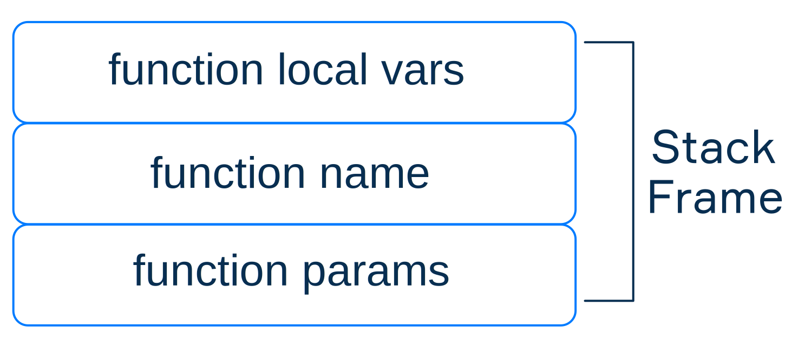
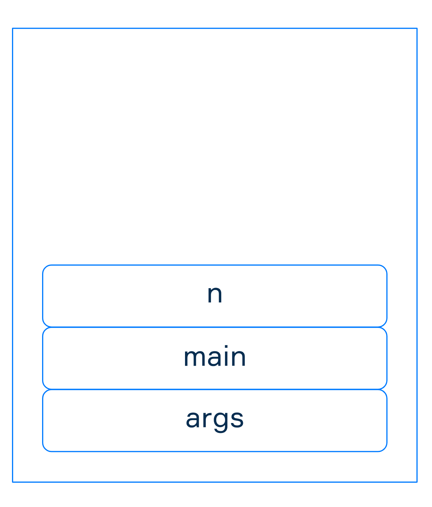
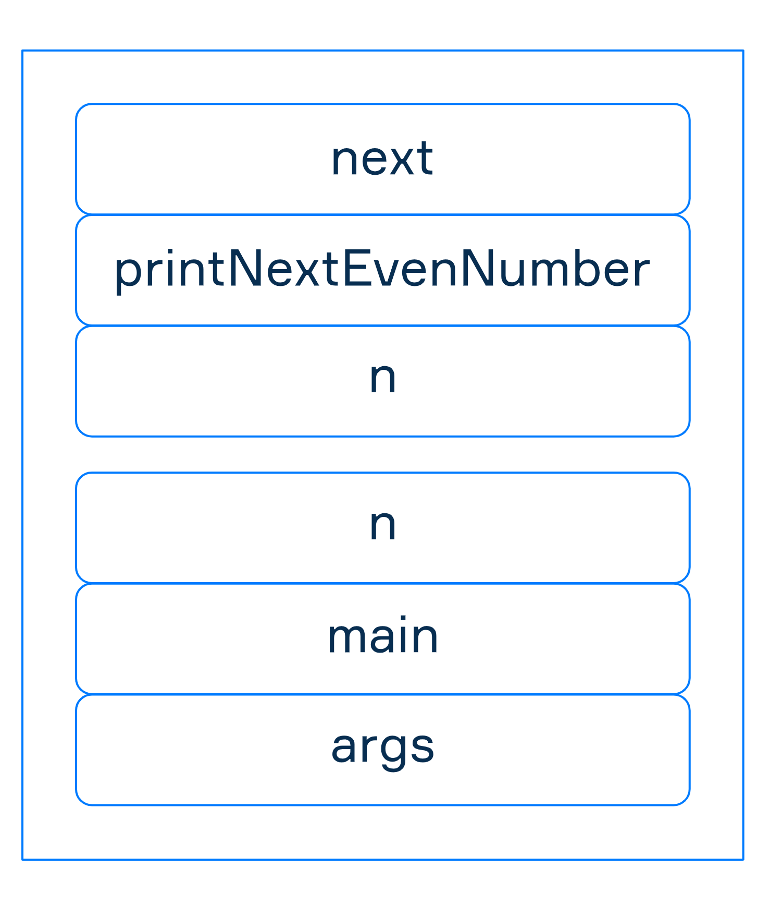

# Стек вызовов

Когда вы пишете программу, она, вероятно, содержит несколько функций, вызывающих друг друга,
либо определяемых программистом, либо стандартных, и все они должны быть выполнены.
Как машина понимает порядок выполнения? Как он переключается между различными функциями?
Как она узнает, когда выполнение программы завершено?
Чтобы пролить свет на эти вопросы, нам нужно узнать о специальной структуре данных — стеке вызовов.

## Структура стека вызовов

JVM использует **стек вызовов** (или стек **выполнения**), чтобы понять, какая функция должна быть вызвана следующей,
и получить доступ к информации о ней. Стек вызовов состоит из **фреймов стека**, которые хранят информацию о функциях,
которые еще не завершились. Информация включает в себя обратный адрес функции, параметры, локальные переменные,
промежуточные вычисления и некоторые другие данные.



Как обычный стек, стек вызовов следует правилу Last In First Out (LIFO).
Это означает, что фреймы стека помещаются вверху и движутся вниз.
Новый фрейм стека добавляется, когда выполнение переходит в новую функцию.
И фрейм стека удаляется из стека вызовов, если выполняется функция.

## Пример стекового фрейма

Давайте рассмотрим пример **стека вызовов** для программы, которая выводит следующее четное число из заданного.
Для простоты мы будем использовать число 99 в качестве входных данных.

?> Если вы забыли или не знали, четное число — это число, которое можно разделить на 2 без остатка. В противном случае
число называется нечетным.

Вот программа:

```kotlin
fun printNextEvenNumber(n: Int) {
    val next = if (n % 2 == 0) n + 2 else n + 1
    println(next)
}

fun main(args: Array<String>) {
    val n = 99
    printNextEvenNumber(n)
}
```

Программа объявляет две функции: `printNextEvenNumber` и main.

Как обычно, первая вызываемая функция - `main`. Каждый раз, когда вызывается функция, создается новый фрейм стека.
Фрейм стека для `main` структурирован следующим образом:

1. Параметры функции (`args`) помещаются в фрейм.
2. Адрес функции (показанный на схеме как имя функции — `main`) добавляется во фрейм стека,
   чтобы сохранить ссылку на то, куда возвращаться из следующих вызовов функций.
3. Локальные переменные (`n`) добавляются во фрейм.

На рисунке ниже представлен результирующий стек вызовов с фреймом `main` стека внутри.



!> На самом деле в стеке хранится только ссылка на массив `args`, поскольку все ссылочные типы хранятся в heap-памяти.
Но в стеке хранится фактическое значение `n` (которое в нашем примере равно `99`).

## Выполнение стека и функций

Следующая вызываемая функция - `printNextEvenNumber`. Как всегда, создается новый фрейм стека.
Параметры функции (`n`), адрес (`printNextEvenNumber` для простоты) и
локальные переменные (`next`) добавляются в новый фрейм стека.

У нас есть два полных фрейма стека для функций `main` и `printNextEvenNumber` в стеке выполнения:



?> Обратите внимание, что оба фрейма имеют переменные с именем `n`, но эти переменные не совпадают, поскольку они
принадлежат разным функциям.

Теперь программа выполняет функцию в верхней части стека вызовов (`printNextEvenNumber`).
После выполнения текущий фрейм `printNextEvenNumber` удаляется из стека вызовов,
а предыдущий фрейм `main` продолжает выполнение.


Стандартная функция `println` работает аналогично функциям, которые мы определили — создается новый фрейм стека,
и когда `println` завершает свою работу, `printNextEvenNumber` продолжает выполнение.

Любая программа Kotlin или Java работает почти таким же образом.
Когда стек пуст, выполнение останавливается. Мы опускаем некоторые детали, чтобы упростить объяснение,
и даем вам только общее представление.

## Переполнение стека

Количество возможных вызовов функций зависит от объема памяти, выделенной стеку.
Когда ваш стек содержит слишком много фреймов стека, он может быть переполнен.
Это приводит к `StackOverflowError`, который остановит выполнение программы.
Размер стека можно задать с помощью опции командной строки `-Xss` для выполнения определенной программы:

```bash
java название_программы -Xss256k
```

Но мы рекомендуем вам быть осторожными с этим и прочитать некоторые статьи в Интернете,
прежде чем изменять размер стека по умолчанию.
Кроме того, иногда ошибка `StackOverflowError` указывает на неправильные вызовы рекурсии в вашей программе.
В этом случае увеличение размера стека вам не поможет.

## Заключение

* Стек вызовов — это специальная структура данных, соответствующая правилу LIFO, используемая JVM для определения
  порядка выполнения функций и доступа к информации о функциях.
* Стек вызовов состоит из фреймов, содержащих информацию о функциях, которые были вызваны и еще не завершили свое
  выполнение.
* Машина выполняет функции поверх стека вызовов. Если эта функция вызывает новую, то новый фрейм добавляется в стек
  вызовов, и выполнение переходит к этой новой функции, и так далее. Когда верхняя функция завершает выполнение,
  соответствующий фрейм удаляется из стека вызовов, и выполнение переходит к следующей верхней функции.
* Стек вызовов, содержащий слишком фреймов, может привести к `StackOverflowError`. Таким образом, вам нужно быть
  осторожным при использовании рекурсивных вызовов в вашей программе.
