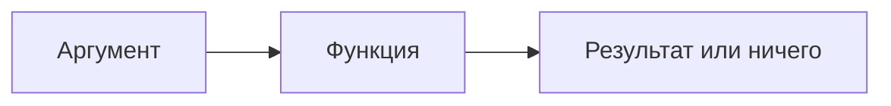

# Вызов функций

Как вы помните, мы уже обсуждали функции раньше. Но что такое функция? Как мы можем их использовать?
Функция — это **последовательность инструкций**, мы можем вызвать ее из программы, вызвав её по имени.
Функции представляют собой подпрограммы, и они выполняют некоторые действия,
например, вывод данных на стандартный вывод, вычисление квадратного корня и так далее.

На рисунке ниже показано, как работают функции.
По сути, это просто поле, которое обрабатывает входные аргументы (**входные данные**)
и выдает либо полезный результат, либо ничего.



## Аргументы функций

Когда мы хотим использовать функцию, мы можем вызвать (или вызвать) её,
используя имя, за которым следуют круглые скобки.
Если функция принимает один или несколько аргументов (входных данных),
они должны быть переданы в круглых скобках.

В приведенном ниже примере мы вызываем функцию `println` с аргументом из одной строки:

```kotlin
val text = "Hello"
println(text)
```

Эта функция также может вообще не принимать аргументов для печати новой строки:

```kotlin
println()
```

Итак, в своём общем виде функция может быть вызвана следующим образом:

```kotlin
function1() // вызываем function1 без аргументов
function2(arg1) // вызываем function2 с передачей аргумента
function3(arg1, arg2) // вызываем function3 с передачей двух аргументов
```

## Получение результата

Некоторые функции не только принимают аргументы, но и выдают (возвращают) некоторые результаты.
Вы также можете присвоить его переменной:

```kotlin
val result = function(arg)
```

Функции, которые принимают аргументы и выдают результат, выглядят как обычные математические функции.

Например, давайте посмотрим на математическую функцию, которая возвращает абсолютное значение числа:

```kotlin
val number = -10
val nonNegNumber = Math.abs(number) // принимает -10 и возвращает 10
```

?> Название функции abs записывается после символа точки.
Причина в том, что `Math` группирует несколько функций, и мы должны написать имя группы, чтобы вызвать одну из них.
Мы не будем сейчас вдаваться в подробности, просто имейте в виду,
что вы увидите нечто подобное в наших примерах и практических задачах.

Все функции **возвращают** результат, даже функция `println`.

```kotlin
val result = println("text")
println(result) // kotlin.Unit
```

Результатом является специальное значение, называемое `Unit`, которое означает `отсутствует результат`.

## Заключение

В этом разделе мы обсудили, что такое функция и как вызывать стандартные функции в Kotlin.
В следующем разделе вы узнаете, как объявлять свои собственные функции и как использовать функции,
написанные другими программистами.
