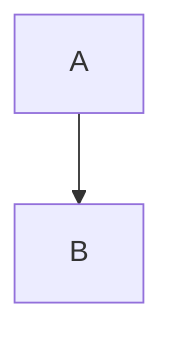
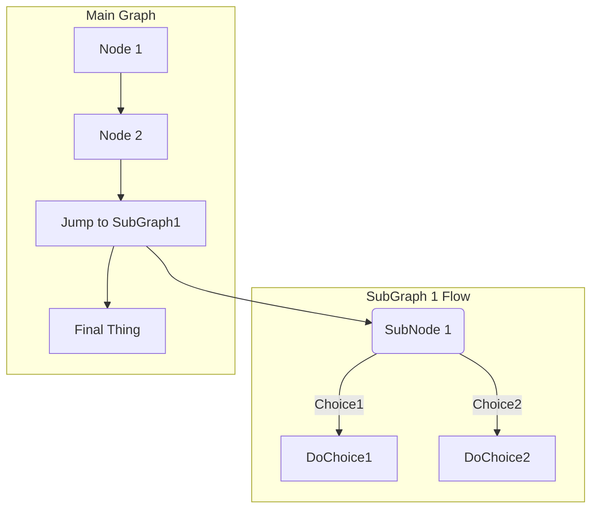

# Вызов функций

Как вы помните, мы уже обсуждали функции раньше. Но что такое функция? Как мы можем их использовать?
Функция — это последовательность инструкций, мы можем вызвать ее из программы, вызвав её по имени.
Функции представляют собой подпрограммы, и они выполняют некоторые действия,
например, вывод данных на стандартный вывод, вычисление квадратного корня и так далее.

На рисунке ниже показано, как работают функции.
По сути, это просто поле, которое обрабатывает входные аргументы (входные данные)
и выдает либо полезный результат, либо ничего.

