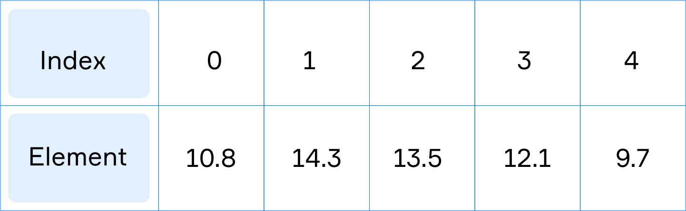

# Введение в MutableList

В предыдущих разделах вы узнали, как объявлять переменные для хранения данных и управления ими.
Но что, если хотим сохранить и обработать не одно значение, а несколько данных одного типа? 
В таких случаях мы прибегаем к использованию списка, 
который позволяет нам обрабатывать несколько значений одного и того же типа как единое целое. 
В этом разделе мы рассмотрим, что такое `MutableList` и как мы можем использовать его для хранения и обработки данных. 
Это удобно в тех случаях, когда вы точно не знаете, сколько элементов программа будет обрабатывать во время выполнения.

## Введение в MutableList

Стандартная библиотека Kotlin предоставляет множество способов организации данных и группировки нескольких значений. 
Теперь мы рассмотрим один из них – **Изменяемый список** (`MutableList`).

[`MutableList`](https://kotlinlang.org/api/latest/jvm/stdlib/kotlin.collections/-mutable-list/)
представляет собой упорядоченный список переменных одного и того же типа. 
Вы можете получить доступ к элементам списка по их индексам.

```kotlin
val numbers = mutableListOf(10.8, 14.3, 13.5, 12.1, 9.7) 

println(numbers) // [10.8, 14.3, 13.5, 12.1, 9.7]
```

На рисунке ниже показан изменяемый список из пяти чисел с плавающей запятой. 
Каждый элемент имеет целочисленный индекс (`0-4`), поэтому вы можете получить доступ к элементу, 
обратившись к его индексу. Первый элемент всегда имеет индекс `0`, а последний элемент имеет индекс, 
равный размеру списка минус единица (`numbers.size - 1`).


> Изменяемый список из пяти элементов с плавающей запятой

## Создание MutableList с указанными элементами

В Kotlin функция `mutableListOf()` используется для создания объекта класса `MutableList`.

Kotlin может обрабатывать любые типы `MutableList`, которые вы хотите,
например: `Int`, `Long`, `Double`, `Float`, `Char`, `String`, `Byte` или `Boolean`.

Вот пример создания изменяемого списка в тех случаях, когда мы знаем тип содержимого. 
В угловых скобках `<>` вы можете указать тип данных, которые будут храниться в списке. 
Вы узнаете больше о `<>` в следующих разделах.

```kotlin
// объявление изменяемого списка целых чисел
val mutableListA = mutableListOf<Int>(1, 2, 3, 4, 3)
println(mutableListA)
  
// объявление изменяемого списка строк
val mutableListB = mutableListOf<String>("Learn", "Kotlin")
println(mutableListB)
  
// объявление пустого изменяемого списка Boolean
val mutableListC = mutableListOf<Boolean>()
println("Empty list $mutableListC")
```

Приведенный выше фрагмент кода выводит три списка:

```
[1, 2, 3, 4, 3]
[Learn, Kotlin]
Empty list []
```

Кроме того, Kotlin позволяет вам явно не указывать, какой тип данных хранится в списке:

```kotlin
// объявление изменяемого списка целых чисел
val mutableListA = mutableListOf(1, 2, 3, 4, 5)

println(mutableListA) // [1, 2, 3, 4, 5]
```

## Размер MutableList

Чтобы создать изменяемый список заданного размера `n`, мы используем функцию `MutableList(n)`:

```kotlin
val list = MutableList(5) { 0 }

println(list) // [0, 0, 0, 0, 0]
```

В фигурных скобках мы записываем объект, который будет составлять наш список. 
Например, если вы укажете `"a"`, список будет содержать 5 элементов, равных `"a"`:

```kotlin
val list = MutableList(5) { "a" }

println(list) // [a, a, a, a, a]
```

Изменяемый список всегда имеет заданный размер, то есть количество элементов. 
Чтобы получить его, нам нужно получить значение `size`. Это число типа `Int`.

```kotlin
val numbers = mutableListOf<Int>(1, 2, 3, 4, 5)

println(numbers.size) // 5 
```

## Чтение списка из входных данных

Вам не нужно разбираться со всеми фрагментами прямо сейчас, просто используйте их в качестве шаблона в своих проектах!

Чтобы прочитать список определенного размера из консоли, 
нам сначала нужно создать `MutableList` некоторого типа с известным размером. 
Внутри фигурных скобок мы должны поместить `readln()`, с помощью которого мы можем считывать входные данные с консоли. 
Функция `readln()` возвращает строку, поэтому не забудьте преобразовать входную строку в тип созданного списка.

```kotlin
val numbers = MutableList(5) { readln().toInt() } // в каждой строке одиночные числа от 1 до 5
println(numbers) // [1, 2, 3, 4, 5]
```

Этот код позволяет вам прочитать 5 чисел, каждое число в отдельной строке.

Если вы хотите прочитать список в одной строке, используйте следующий подход. 
Вы можете прочитать список с помощью функции `readln()`. Вы получите строку, которую вы должны разделить.

```kotlin
// здесь у нас есть входная строка "1 2 3 4 5"

val numbers = readln().split(" ").map { it.toInt() }.toMutableList()
println(numbers) // [1, 2, 3, 4, 5]
```

Давайте взглянем на этот фрагмент кода. Мы считываем строку из входных данных, а затем используем `split()`. 
Мы делим нашу строку на меньшие по размеру с помощью пробела, 
затем используем функцию `map` для преобразования каждого элемента в `Int`, 
а затем преобразуем результат в `MutableList`. 
[Здесь](https://kotlinlang.org/docs/collection-transformations.html#map) 
вы можете прочитать больше о преобразовании с помощью `map`.

Существует также способ, позволяющий игнорировать разрывы строк и дополнительные пробелы во входной строке. 
Вы можете сделать это с помощью регулярных выражений, 
которые часто используются в поиске и редактировании текста.

```kotlin
val regex = "\\s+".toRegex()  // 1 или более пробельных символов (пробел, табуляция и т.д.)
val str = "1 2\t\t3  4\t5  6"
val nums = str.split(regex).map { it.toInt() }.toMutableList()
println(nums.joinToString()) // 1, 2, 3, 4, 5, 6
```

С помощью этого регулярного выражения вы можете игнорировать пробелы и символы табуляции во входной строке. 
Вы можете узнать больше о регулярных выражениях в наших [разделах](../../additional-instruments/regex/regexps.md).

## Доступ к элементам

Вы можете изменять значения изменяемых элементов списка. Используйте индекс, чтобы задать значение в списке.

Установка значения элемента с использованием индекса элемента:

```kotlin
list[index] = elem
```

Получение значения элемента с использованием индекса элемента:

```kotlin
val elem = list[index]
```

Индексы списка - это числа от `0` (первый элемент) до `list.size - 1` (последний элемент).

Вот пример трехэлементного списка целых чисел:

```kotlin
val numbers = mutableListOf(0, 0, 0) // числа: 0, 0, 0

numbers[0] = 1 // числа: 1, 0, 0
numbers[1] = 2 // числа: 1, 2, 0
numbers[2] = numbers[0] + numbers[1] // числа: 1, 2, 3

println(numbers[0]) // 1, первый элемент
println(numbers[2]) // 3, последний элемент
```

Давайте подробнее рассмотрим приведенный выше код. Во-первых, у нас есть список из трех элементов. 
Все элементы равны `0`. Затем первому элементу списка с индексом `0` присваивается значение `1`. 
Затем второму элементу списка с индексом `1` присваивается значение `2`. 
После этого последнему элементу списка с индексом `2` присваивается значение `3` (сумма `1` и `2`). 
Затем мы печатаем первый и последний элементы списка с индексом `2`. 
Затем мы печатаем первый и последний элементы трехэлементного списка.

Если мы попытаемся получить доступ к несуществующему элементу по индексу, в программе возникнет ошибка. 
Давайте попробуем получить четвертый элемент с индексом `3` в приведенном выше списке `numbers`:

```kotlin
val elem = numbers[3]
```

Ваша программа выдаст ошибку.

Как вы уже знаете, последний элемент списка имеет индекс, равный `list.size - 1`. 
Давайте обратимся к последнему элементу и к предпоследнему:

```kotlin
val alphabet = mutableListOf('a', 'b', 'c', 'd')

val last = alphabet[alphabet.size - 1]    // 'd'
val prelast = alphabet[alphabet.size - 2] // 'c'
```

Kotlin предоставляет несколько удобных способов получения первого и последнего элементов списка, 
а также последнего индекса в списке:

```kotlin
println(alphabet.first())   // 'a'
println(alphabet.last())    // 'd'
println(alphabet.lastIndex) // 3
```

Используйте этот подход, чтобы сделать ваш код более читаемым и избежать доступа к несуществующим индексам.

## Заключение

В этом разделе мы обсудили концепцию изменяемого списка и основные операции с ним. Пожалуйста, помните, что:
- Изменяемый список - это структура данных элементов, доступ к которым можно получить по индексу
- Первый элемент списка имеет индекс `0`
- Изменяемый список всегда имеет заданный размер
- Можно изменить элемент списка, используя индекс элемента
- Kotlin может обрабатывать списки различных типов: `Int`, `Char`, `Double` и так далее.
